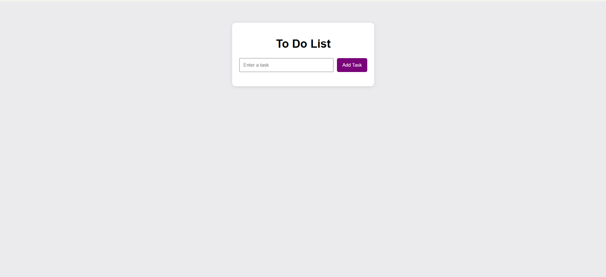
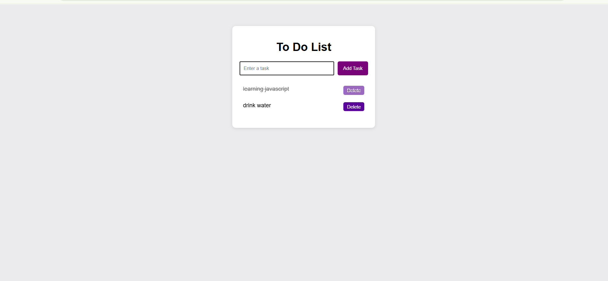

#  To-Do List Web App (Vanilla JavaScript)

## 📚 Table of Contents
- [📌 To Do List](#-to-do-list-web-app-vanilla-javascript)
- [🛠 Built With](#-built-with)
  - [Tech Stack](#tech-stack)
  - [Key Features](#key-features)
- [🚀 Live Demo](#-live-demo)
- [💻 Getting Started](#-getting-started)
- [📜 License](#-license)

---

## 📖 To Do List Web App (Vanilla JavaScript)

This is a Front-End To-Do List Web Application built using HTML, CSS, and Vanilla JavaScript.

---

## Built With

### Tech Stack
- HTML5  
- CSS3  
- Vanilla JavaScript (ES6)  

---

### Key Features
- Add Tasks  
- Delete Tasks  
- Mark Tasks as Completed  
- Enter Key Support  
- Input Validation  
- Instant UI Update  

---

[Live demo](https://anushavv3.github.io/To-do-list/)

---

